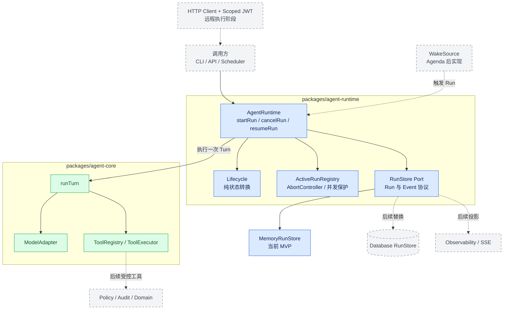
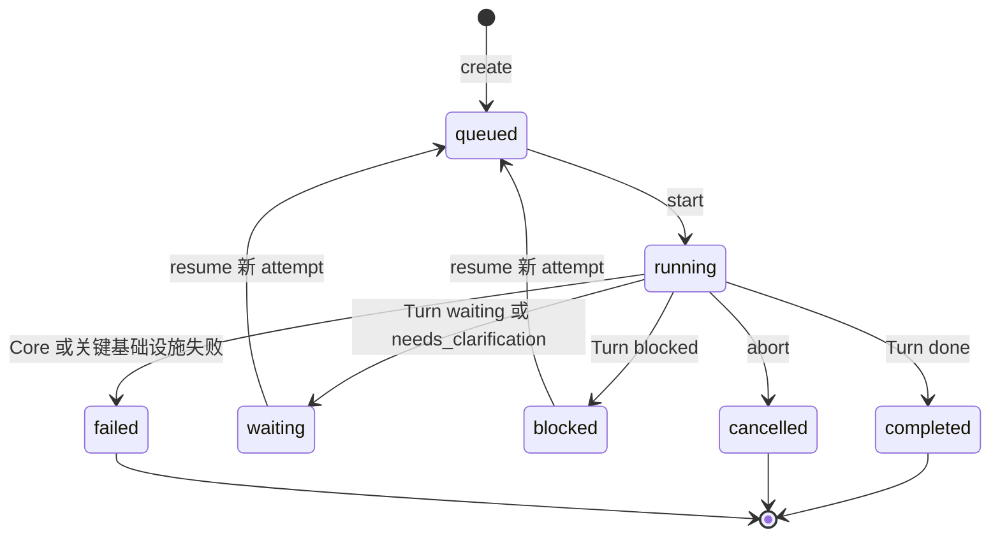
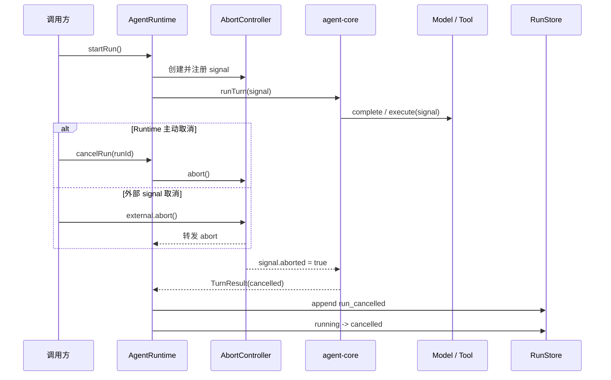
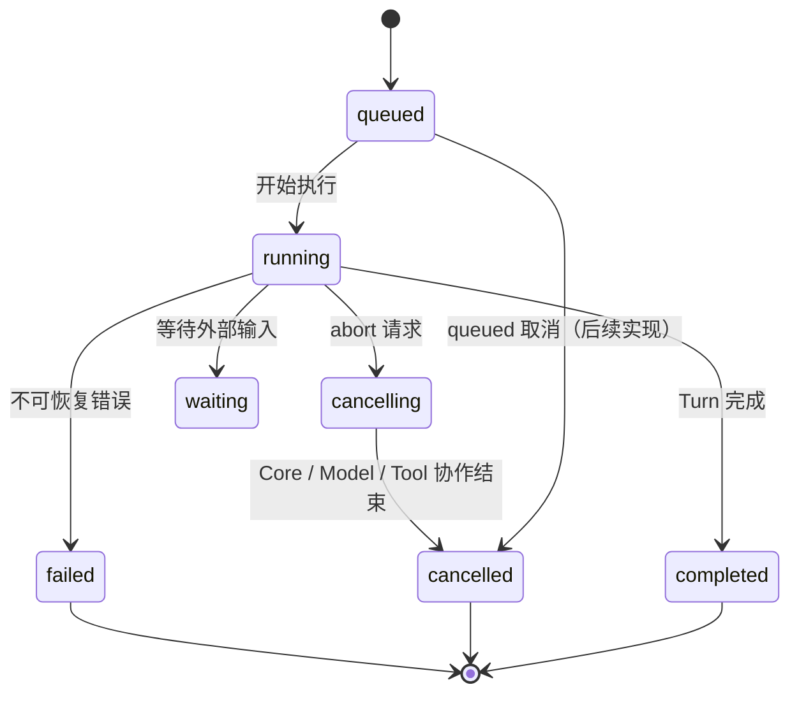

# FastMPA Agent Runtime 学习与实施计划

`agent-core` 已完成一次 Turn 内的模型调用、工具循环、取消、步数限制和结果生成。下一阶段实现 `agent-runtime`：管理一个 `AgentRun` 从创建到结束的生命周期，并为后续持久化、API、Wake 和远程执行建立稳定边界。

本阶段仍由学习者手动实现。Cumora 用来理解问题和设计取舍，不作为逐文件复制模板。

## 一、Runtime 的职责边界

```text
调用方
  ↓ startRun(request)
Agent Runtime
  ├── 创建 Run ID
  ├── 执行生命周期转换
  ├── 调用 agent-core.runTurn()
  ├── 保存 Run 与事件
  ├── 传播取消信号
  └── 返回 RunResult
        ↓
Agent Core / Turn
```

Runtime 负责 Run 生命周期、事件、取消、并发和恢复入口；Core 负责单次 Turn。Runtime 不负责 APM 状态机、审批规则、数据库 SQL、HTTP 路由、模型协议或具体业务工具。

### Runtime 分层架构图



蓝色节点是本阶段实现范围，绿色节点是已完成的 Core，虚线灰色节点是后续适配器。依赖方向始终指向接口：Runtime 可以依赖 Core 和 `RunStore` 端口，Core 不反向依赖 Runtime，Memory/Database 只是可替换实现。

### AgentRun 生命周期图



`waiting` 与 `blocked` 保存历史后通过新的 attempt 恢复；`completed`、`cancelled`、`failed` 是终态，不能直接改回 `running`。

## 二、从 Cumora 学什么

按以下顺序阅读：

1. `server/src/agents/runtime/client.ts`：Runtime 与外部世界之间使用接口和 JSON-friendly 数据，不让数据库类型泄漏。
2. `inproc-client.ts`：同进程实现如何满足同一接口；重点看边界，不追逐全部业务方法。
3. `select.ts`：调用方只依赖接口，由配置选择 InProc 或 HTTP 实现。
4. `http-client.ts` 与 `agents-runtime-http-client.test.ts`：区分关键读取和 best-effort 写入。`loadInbox`、`loadPersona`、`createRun` 失败必须终止；状态、心跳、typing、观测事件失败不应杀死 Turn。
5. `server.ts`：HTTP 只暴露 Runtime 协议，不承载 Agent 推理。
6. `wake-bus.ts` 与 `agents-wake-reconnect.test.ts`：游标、断线重连、退避和重复事件是后期能力。
7. `jwt.ts`：远程 Runtime 使用短期、带 agent/company/scope 的身份令牌。
8. `docs/COORDINATION.md`：Claim、Freshness 和原子门禁属于并发协作层，不应混入第一版生命周期内核。

Cumora 的 `AgentRuntimeClient` 已承载大量聊天、记忆、状态和协作能力。FastMPA 第一版不要复制这个大接口，应拆成小端口：`RunStore`、`EventSink`、未来的 `WakeSource` 和领域工具适配器。

## 三、目标包结构

```text
packages/agent-runtime/
├── README.md
├── CHANGELOG.md
├── package.json
├── tsconfig.json
├── vite.config.ts
├── src/
│   ├── index.ts
│   ├── runtime.ts              # startRun / cancelRun / getRun
│   ├── lifecycle.ts            # 纯状态转换规则
│   ├── cancellation.ts         # AbortController 管理
│   ├── errors.ts               # RuntimeError 与可序列化错误
│   ├── types/
│   │   ├── run.ts              # AgentRun、RunStatus、RunRequest
│   │   ├── event.ts            # RuntimeEvent
│   │   └── index.ts
│   └── store/
│       ├── run-store.ts        # RunStore 端口
│       ├── memory-run-store.ts # 第一版实现
│       └── index.ts
└── tests/
    ├── lifecycle.test.ts
    ├── memory-run-store.test.ts
    └── runtime.test.ts
```

第一版依赖只需要 `agent-core`、TypeScript、Vitest 和构建工具。时钟、ID 生成器和日志器尽量通过接口注入，使测试不依赖真实时间和随机 UUID。

## 四、核心数据模型

建议从以下最小模型开始，具体字段由实现者在编码前确认：

```ts
type RunStatus =
  | 'queued'
  | 'running'
  | 'waiting'
  | 'blocked'
  | 'completed'
  | 'cancelled'
  | 'failed'

interface AgentRun {
  runId: string
  status: RunStatus
  attempt: number
  createdAt: string
  startedAt?: string
  finishedAt?: string
  turnResult?: TurnResult
  error?: SerializedError
  version: number
}
```

不要把原生 `Error` 直接当作持久化协议；转换成包含 `name`、`message`、`code`、`retryable` 的可序列化结构。`version` 为后续乐观锁和数据库迁移预留。

状态转换必须集中在纯函数中：

```text
queued → running
running → completed | waiting | blocked | cancelled | failed
waiting | blocked → queued       # 后续显式恢复
终态不能直接回到 running
```

## 五、分阶段实施

### 阶段 R0：设计与映射

先画出 `RunStatus` 状态图，并建立 `TurnStatus → RunStatus` 映射。明确：Turn 的 `done` 映射为 Run 的 `completed`；`needs_clarification` 第一版映射为 `waiting`，并通过结果保留原始 Turn 状态。

产出：类型草案、状态图和一页 ADR，说明 Turn 与 Run 为什么分离。

### 阶段 R1：生命周期内核

只实现 `types/run.ts` 和 `lifecycle.ts`。状态转换函数必须是纯函数，非法转换抛出结构化 `RuntimeError`，不读取时间、不访问 Store。

测试：所有合法转换、所有非法转换、终态不可重开、版本递增。

### 阶段 R2：内存 RunStore

定义最小端口：

```ts
interface RunStore {
  create(run: AgentRun): Promise<void>
  get(runId: string): Promise<AgentRun | undefined>
  transition(runId: string, expectedVersion: number, next: AgentRun): Promise<void>
  appendEvent(event: RuntimeEvent): Promise<void>
  listEvents(runId: string): Promise<readonly RuntimeEvent[]>
}
```

`MemoryRunStore` 必须复制输入/输出，避免调用方通过对象引用绕过状态机；重复 Run ID 和版本冲突要明确失败。

### 阶段 R3：最小 Runtime（已完成）

已实现 `packages/agent-runtime/src/runtime.ts` 的 `AgentRuntime.startRun()`：创建 `queued` Run，转换为 `running`，调用 `agent-core.runTurn()`，映射结果并保存 RuntimeEvent。当前通过 `MemoryRunStore` 注入 Store，模型与工具仍由调用方注入；Clock、ID Generator 和 Logger 留到后续阶段。

验证：`pnpm --filter agent-runtime typecheck`、`pnpm --filter agent-runtime test`（32 tests passed）。

### 阶段 R4：取消与并发（已完成）

已实现 `cancelRun(runId)` 和同一 `runId` 的并发占用保护：Runtime 持有每个活动 Run 的 `AbortController`，重复启动会返回 `RunAlreadyActiveError`，不会悄悄并行。

测试：运行前取消、模型执行中取消、多个工具之间取消、完成后取消、重复取消和并发启动。

### 取消模型

Runtime 通过内部 `AbortController` 统一接收两类取消请求：调用方传入的外部 signal，以及 `cancelRun(runId)`。模型和工具必须协作监听 signal；取消请求不是强制杀死线程。





当前已支持 `running` 阶段取消；`queued` 取消和取消/完成之间的竞态保护属于后续并发阶段。

### 阶段 R5：失败与重试策略（基础版已完成）

区分：

- 关键失败：无法创建 Run、无法读取必要状态、Store 冲突——立即失败；
- best-effort 失败：日志或非关键观测事件写入失败——记录警告但不覆盖真实 Turn 结果；
- 可重试模型失败：只有 `ModelExecutionError.retryable === true` 才可能重试；
- 工具已经产生副作用后，禁止自动重跑整个 Turn，否则可能重复评论、改状态或创建任务。

当前已实现 `RetryPolicy`、`shouldRetry()` 和 `running → retrying → running` 流程：只有错误明确标记 `retryable` 且未超过 `maxAttempts` 时才重试，并递增 `attempt`。指数退避、幂等键和带副作用工具的安全重试留到 Policy/Audit 阶段。

### 阶段 R6：恢复协议（基础版已完成）

已实现 `resumeRun(runId, input)`：只能从 `waiting` 或 `blocked` 显式恢复，先回到 `queued` 再进入 `running`，递增 `attempt`，保留旧事件并继续递增 sequence。当前仍使用内存 Store，数据库恢复和完整输入持久化留到 R7。

恢复不是从 JavaScript 调用栈继续，而是根据持久化的输入、消息和结果启动新的 Turn。

### 阶段 R7：持久化与 API（后续）

内存版本稳定后，再实现数据库 `RunStore` 和 API 适配器。此时借鉴 Cumora 的 InProc/HTTP 双实现：业务调用方只依赖 Runtime 接口，两种传输必须通过同一组契约测试。

关键读失败应显式传播；心跳和观测写入可降级。HTTP 身份令牌必须包含 agent、tenant 和 scope，不能只依赖请求体中的 ID。

### 阶段 R8：Wake Bus（后续）

只有 Agenda 和主动追踪出现后再实现 Wake。要求单调 cursor、重复事件可幂等处理、断线指数退避、短连接不重置退避阶梯、健康连接后才重置。

Redis、SSE、Pod、Kubernetes 和 BYOA 都不属于当前 Runtime MVP。

## 六、测试矩阵

| 类别 | 必测行为 |
|---|---|
| 生命周期 | 合法/非法转换、终态保护、版本冲突 |
| Store | 重复 ID、未知 Run、不可变快照、事件顺序 |
| Core 集成 | 所有 TurnStatus 映射、TurnEvent 保存 |
| 取消 | 各执行阶段取消、重复取消、完成后取消 |
| 并发 | 同 Run 双启动、不同 Run 独立执行 |
| 错误 | Core 异常、Store 异常、best-effort 事件失败 |
| 恢复 | waiting/blocked 可恢复、终态不可恢复、attempt 递增 |

每个测试使用 FakeModel、固定 Clock 和固定 ID，避免网络、真实时间和随机值。

## 七、阶段验收命令

```bash
pnpm --filter agent-runtime typecheck
pnpm --filter agent-runtime test
pnpm --filter agent-runtime build
pnpm --filter agent-core test
```

Runtime 第一版完成时，应能演示：启动一个 Run、观察状态和事件、取消运行、处理 Core 失败、从 waiting 显式恢复，并证明重复启动和非法状态转换会被拒绝。

## 八、完成后的下一步

Runtime 稳定后进入 `policy` 与 `audit`：让工具副作用具备风险分级、审批、幂等键和审计回执。之后才实现 APM `domain` 与真实 `agent-tools`。这时 Runtime 只负责“何时运行、运行到哪里”，不会承担“业务动作是否允许”的职责。
