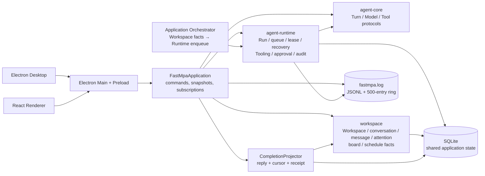
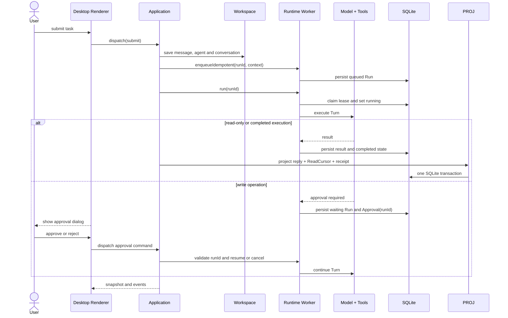
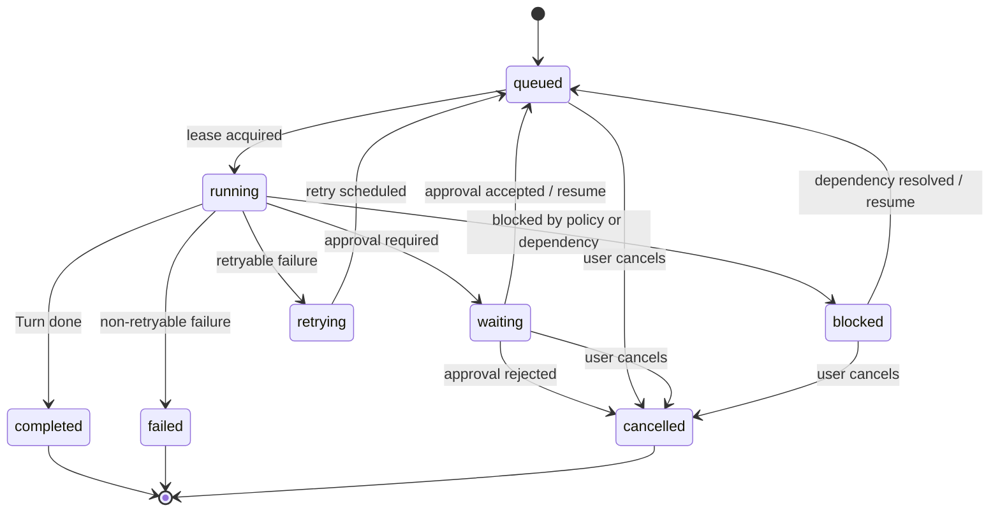

# FastMPA V1 Architecture

FastMPA V1 keeps execution in Runtime and exposes the product through the
UI-independent Application interface in `apps/fastmpa`.

## Final architecture

## Task execution sequence

## Run lifecycle

The persisted Run is the only execution lease. Workspace `ReadCursor` is a
durable projection of completed message work and is replayed during Application
startup to compensate for an interrupted projection.

## Continuous workspace model

`Workspace` is a durable collaboration fact with an immutable ID and mutable
display name. It is not a directory and does not own Runtime execution queues.
`Conversation` is the continuous-dialogue boundary; each submitted turn still
creates one persisted `Run`. Application snapshots may be filtered by
`workspaceId` and `conversationId`, so the Renderer can switch selection without
loading unrelated messages or runs into the active view. Historical records are
backfilled with a Workspace record when SQLite starts; the legacy `default`
workspace is displayed as `Default Workspace`.

Application logs are an independent observation stream. The root Pino logger
tees structured JSONL to the absolute `fastmpa.log` path and a bounded
500-entry in-memory buffer. Log subscribers update only the log panel; message
and model content is not emitted as log context.

The panel can set a minimum level with `1`–`4` and toggle current-Run filtering
with `Ctrl+E`; `Ctrl+L` collapses it without changing the composer.

The workspace Renderer keeps selection and unsent queue state locally. Selection
changes request a filtered Application snapshot; submitted turns are serialized
by Application on `workspaceId:conversationId`, so switching the visible
conversation does not cancel background work or mix its history into another
conversation.

Snapshots also include the selected Workspace's Attention summary. Unsent
composer entries are process-local; attempting to exit while they exist asks
for confirmation and never writes them as durable messages.

When a Run is waiting for approval, the Application coordinator keeps that
conversation's queue occupied until the approval is resolved. Other
conversations remain independent.
