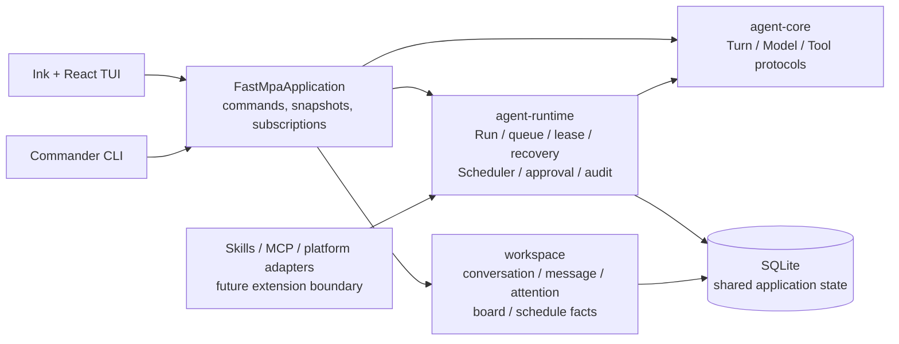
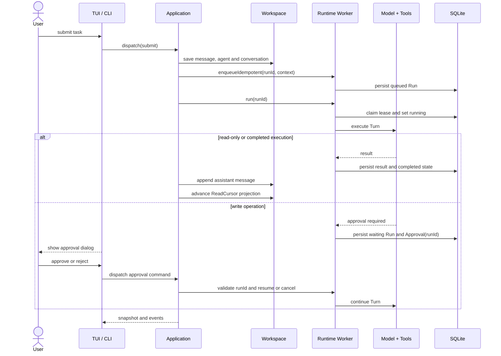
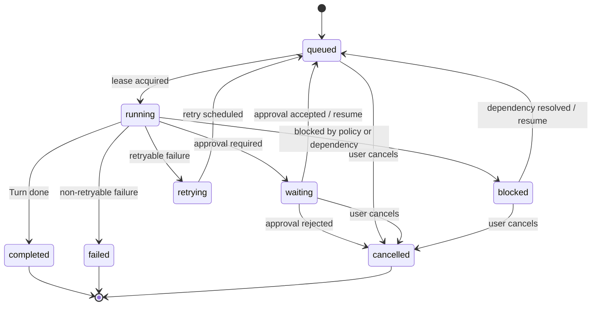

# FastMPA V1 Architecture

FastMPA V1 keeps execution in Runtime and exposes the product through the
UI-independent Application interface in `apps/fastmpa`.

## Final architecture

## Task execution sequence

## Run lifecycle

The persisted Run is the only execution lease. Workspace `ReadCursor` is a
durable projection of completed message work and is replayed during Application
startup to compensate for an interrupted projection.
