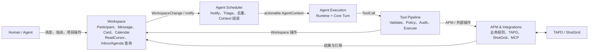
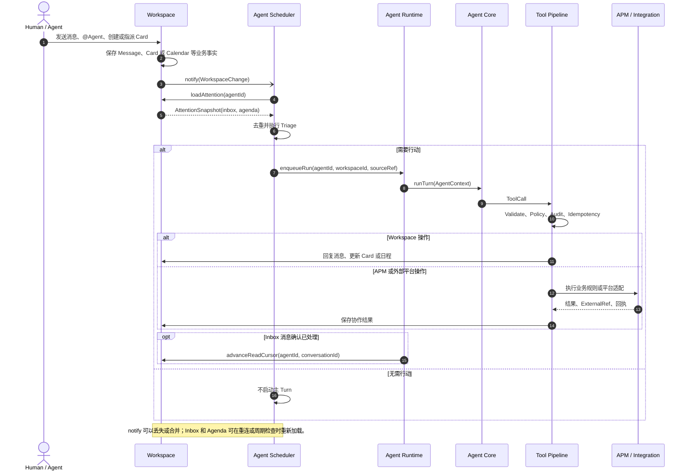

# FastMPA Roadmap

## 产品方向

FastMPA 延续 Cumora 的核心逻辑：Agent 是 Workspace 中的一等 Participant。用户通过消息、@mention、卡片指派和日程推进工作；系统加载该 Agent 的待处理上下文，判断是否需要行动，再启动一次可恢复的 Turn，并通过受控 Tool 把结果写回协作空间或外部平台。

APM 是 Workspace 上的业务扩展，不另建中央 Task Router。Message、Card、Calendar Event 和 Requirement 保持各自语义，Agent 继续使用消息、@mention 和指派进行协作。

## 最终组件架构



顶层只保留五个职责区域：Workspace、Agent Scheduler、Agent Execution、Tool Pipeline、APM/Integrations。Inbox、Agenda、WakeSignal、Triage、Persona、Memory 和 Skills 是这些组件内部的语义，不分别升级成服务或包。

## 最终使用时序



## 融合后的概念边界

### Workspace

Workspace 拥有持久协作事实：Participant、Conversation/Message、Board/Card、Calendar 和每个 Agent/Conversation 的 ReadCursor。

它提供统一查询：

```ts
interface AttentionSnapshot {
  inbox: Message[]
  agenda: AgendaItem[]
}

workspace.loadAttention(agentId): Promise<AttentionSnapshot>
```

- Inbox 是 ReadCursor 之后可见消息的派生视图。
- Agenda 是 Card、Calendar、承诺和停滞工作的派生视图。
- 两者不需要独立 Repository、状态机、存储表或包。
- 业务写入返回轻量 `WorkspaceChange` 供 Scheduler `notify()`；MVP 不建设统一持久事件流。

### Agent Scheduler

Scheduler 内部融合 WakeSignal、Inbox/Agenda Triage、重复提醒合并、优先级和 AgentContext 组装：

```text
notify → loadAttention → triage → enqueueRun
```

WakeSignal 只是低延迟提醒，不是事实来源，也不作为公共领域模型。消息可靠性由 Message + ReadCursor 保证，卡片和日程可靠性由 Workspace 事实保证。

### Agent Execution

现有 `agent-runtime` 负责 AgentRun、生命周期、Store、Lease、恢复和重试；现有 `agent-core` 负责有界 Turn、Model 和 Tool Loop。

Persona、Memory、Skills 和 AttentionSnapshot 在执行前组合为 `AgentContext`，不建立独立顶层组件。进入 Scheduler 阶段时，AgentRun 需要补充 `agentId`、`workspaceId`、`trigger` 和 `sourceRef`。

### Tool Pipeline

Tool 是唯一副作用入口：

```text
validate → authorize → approve if needed
→ idempotency check → execute → audit
```

Policy、Approval、Audit 和 Tool Journal 先作为 Tool Pipeline 的中间件能力，不提前拆成独立包。

### APM 与 Integrations

APM 强制 Requirement、Milestone、Deliverable、Risk 和 Approval 等业务规则。TAPD、ShotGrid 和 MCP 统一适配为 Tool；它们不能绕过 Tool Pipeline 直接修改 Workspace 或启动 Runtime。

## 架构原则

- 保留概念语义，不按概念数量拆组件。
- 只有拥有独立生命周期、数据所有权或替换需求时才创建新包。
- Card、Message、Requirement 和 AgentRun 不统一成通用 Task。
- Inbox/Agenda 是视图；WakeSignal 是提醒；AgentRun 是执行记录。
- Skills 描述工作方法，Tools 执行动作，APM Domain 强制业务规则。
- 先完成单 Agent 闭环，再增加多 Agent、远程 Runtime 和复杂基础设施。

## 里程碑

### M0：Turn Engine（已完成）

`agent-core` 已实现 Model Adapter、Turn/Tool Loop、Context、Guard、取消和结构化结果。

### M1：Durable Runtime（已完成）

`agent-runtime` 已实现 Run/Event 持久化、生命周期、Lease Worker、依赖重建、重试和崩溃恢复。

### M2：Workspace 与 Attention 查询（下一阶段）

创建 `workspace`，实现 Participant、Conversation/Message、Board/Card、ReadCursor 和 `loadAttention(agentId)`。第一版使用内存 Repository，不实现通用事件存储。

验收：Human @Agent 后 Inbox 可查询该消息；Card 指派后 Agenda 可查询该卡片；不同 Workspace 不能交叉引用；业务写入返回可用于 `notify()` 的 WorkspaceChange。

### M3：Agent Scheduler

创建 `agent-scheduler`，实现 `notify → loadAttention → triage → enqueueRun`，并保证重复提醒不会导致同 Agent 并发执行。

验收：notify 丢失后周期检查仍可发现未处理工作；无关输入不启动主 Turn；AgentRun 关联 Agent、Workspace 和来源对象。

### M4：最小协作闭环

增加 Workspace Tools，贯通消息回复和 Card 更新：

```text
User → Workspace → Scheduler → Runtime/Core
→ Tool Pipeline → Workspace
```

使用 FakeModel 完成确定性端到端测试，再使用真实模型进行手动 smoke test。

### M5：APM 领域扩展

创建 `apm`，从 Requirement 垂直切片开始。APM 对象必须关联 Workspace Card、Conversation 或 ExternalRef，不能形成平行任务系统。

### M6：安全 Tool Pipeline

根据真实写操作补充 Policy、Approval、Audit、幂等键和 Tool Call Journal。外部副作用未具备幂等或人工恢复边界前，不自动重放。

### M7：Integrations

创建 `integrations`，先实现 TAPD，再实现 ShotGrid 和 MCP Tool Adapter。复杂度或发布边界真正出现后，再考虑拆分独立 Connector 包。

### M8：多 Agent 与部署扩展

增加项目经理、制作人和需求分析等 AgentContext 配置；Agent 之间继续通过消息、@mention 和 Card 指派协作。最后评估 API/UI、BYOA、Redis 和远程 Pod。

## Monorepo 演进

```text
packages/
├── agent-core/        # 已有：Turn、Model、Tool Loop
├── agent-runtime/     # 已有：Run、Store、Lease、恢复
├── workspace/         # 协作事实、ReadCursor、Attention 查询
├── agent-scheduler/   # Notify、Triage、Context 组装、Dispatch
├── apm/               # APM 规则与 APM Tools
└── integrations/      # TAPD、ShotGrid、MCP Tool Adapter
```

当前只创建 `workspace`。后续包必须在出现第一个真实消费者时创建，不增加 `inbox`、`agenda`、`policy`、`audit`、`task-router` 或 `assignment-engine` 包。
