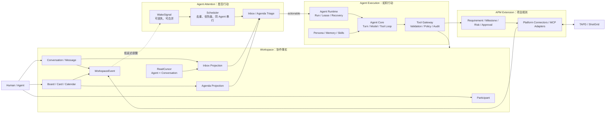
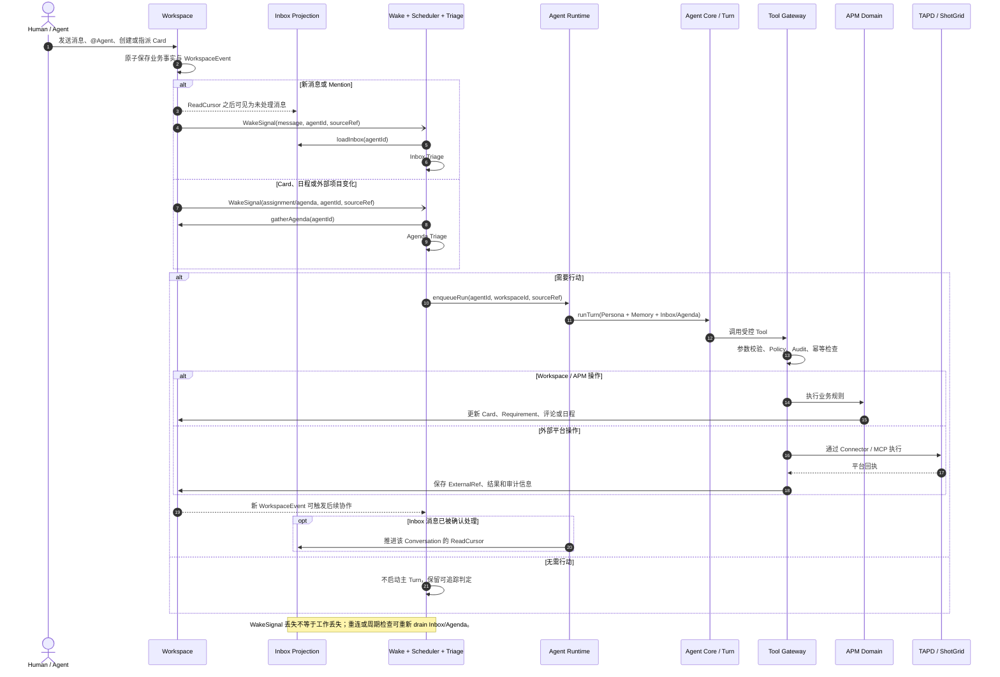

# FastMPA Roadmap

## 产品方向

FastMPA 延续 Cumora 的核心抽象：Agent 是 Workspace 中的一等 `Participant`。消息、卡片、日程或外部平台变化形成持久事实，系统用 `WakeSignal` 提醒相关 Agent；Agent 在独立 Runtime 中执行一次 Turn，并通过受控 Tools 将结果写回 Workspace。

APM 是这套协作闭环上的领域扩展，不另建一套通用 Task Router。显式负责人使用 `assigneeId`，协作使用消息、@mention 和卡片分配；自动处理由 Agenda 与 Agent 能力决定。

## 最终组件架构



依赖方向以 Workspace 事实为中心：Attention 读取 Inbox/Agenda，Execution 消费已经确定的 Agent 上下文，Tool Gateway 才能修改 Workspace、APM 或外部平台。Connector 和 MCP 不能绕过 Tool Policy/Audit 直接驱动 Runtime。

## 最终使用时序



## 概念与术语审查

| 概念 | 所属组件 | 持久性 | 明确职责 |
|---|---|---:|---|
| `Participant` | Workspace | 是 | Human/Agent 的统一成员身份；Persona 不是另一套成员模型 |
| `Message` / `Card` / `Event` | Workspace | 是 | 协作事实和工作载体，不再抽象成通用 `Task` |
| `WorkspaceEvent` | Workspace | 是 | 记录业务事实变化，区别于 Runtime 执行事件 |
| `ReadCursor` | Workspace/Inbox | 是 | 每个 Agent、每个 Conversation 的处理边界 |
| `Inbox` | Workspace 投影 | 派生 | 查询 ReadCursor 之后可见的消息，不是队列或任务表 |
| `Agenda` | Agent 投影 | 派生 | 汇总 Card、日程、承诺和停滞工作，不承载未读消息 |
| `WakeSignal` | Scheduler | 否 | 低延迟提醒；允许丢失、重复、合并，不作为事实来源 |
| `TriageVerdict` | Agents/Attention | 可观测 | 低成本判断是否启动主 Turn，不决定业务状态 |
| `AgentRun` / `RuntimeEvent` | Runtime | 是 | 一次执行的生命周期和技术事件，不等于项目任务状态 |
| `Turn` | Agent Core | 运行期 | 有界的模型与 Tool 循环，不加载数据库或决定调度 |
| `Skill` | Agent Context | 配置 | 描述工作方法，不直接产生副作用 |
| `Tool` | Tool Gateway | 调用/审计 | 执行动作；所有写入经过验证、Policy、Audit 和幂等边界 |
| `MCP Adapter` / `Connector` | Integration | 配置/状态 | 将外部能力适配为 Tool，并维护外部引用和同步游标 |
| APM Domain | APM Extension | 是 | 强制 Requirement、Milestone、Risk、Approval 等业务规则 |

当前代码中的 `agent-core` 与上述 Turn/Tool Loop 一致；`agent-runtime` 与 Run/Store/Lease 一致。进入 M3 时需要为 `AgentRun` 补充 `agentId`、`workspaceId`、`trigger` 和 `sourceRef`，但不能让 Runtime 反向承担 Inbox、Agenda 或选人逻辑。

## 架构原则

- 保留 Cumora 的 `Participant`、Workspace、Inbox、`WakeSignal`、Agenda、Runtime、Turn 和 Tool 概念。
- Card、Message、Event 本身承载工作，不强制统一为抽象 `Task`。
- Inbox 是“消息 + Agent 读取边界”形成的持久待处理视图；`WakeSignal` 只是可丢失、可合并的实时提醒。
- Runtime 只保证执行、持久化和恢复，不决定业务负责人或 APM 状态。
- APM 领域不依赖 TAPD、ShotGrid SDK；Connector 负责外部模型映射。
- Skills 描述工作方法，Tools 执行动作，Domain 维护业务规则。
- 先完成单 Agent 垂直闭环，再扩展多 Agent、远程 Runtime 和复杂基础设施。

## 里程碑

### M0：Turn Engine（已完成）

`agent-core` 已实现 Model Adapter、Turn/Tool Loop、Context、Guard、取消和结构化结果。

### M1：Durable Runtime（已完成）

`agent-runtime` 已实现 Run/Event 持久化、生命周期、Lease Worker、依赖重建、重试和崩溃恢复。后续仅为真实 Wake 链路补充必要字段，不继续独立扩张基础设施。

### M2：最小 Workspace 与 Inbox（下一阶段）

实现 `Participant`、Conversation/Message、Board/Card、WorkspaceEvent、按 Agent/Conversation 保存的 ReadCursor 和 Inbox Projection。第一版使用内存 Repository，并建立清晰的 tenant/workspace 边界。

验收：Human 和 Agent 可加入同一 Workspace；Human 能发消息、创建卡片并把卡片分配给 Agent；Agent 可查询读取边界之后的 Inbox；所有变更生成可查询事件。

### M3：Wake、Inbox/Agenda Triage 与 Scheduler

实现带 `agentId`、`workspaceId`、`reason`、`sourceRef` 的 `WakeSignal`；Inbox Triage 判断未读消息是否需要响应；Agenda 汇总分配卡片、到期事项和停滞工作；Agenda Triage 判断是否值得主动行动；Scheduler 负责去重、优先级和同 Agent 串行执行。

验收：卡片指派或 @Agent 后只唤醒目标 Agent；WakeSignal 丢失后仍可从 Inbox 恢复未读消息；重复信号不会导致并发执行；Turn 能读取相关 Workspace 上下文。

### M4：Cumora 最小闭环

提供消息和看板 Tools，贯通：

```text
Message → Inbox ─┐
                 ├→ Wake → Triage → Turn
Card/Event → Agenda ┘
→ 回复消息/更新卡片 → 产生新事件
```

验收：使用 `FakeModel` 完成确定性端到端测试，再使用真实模型做手动 smoke test。

### M5：APM 领域扩展

实现 Requirement、Milestone、Deliverable、Dependency、Risk/Issue 和 Approval。APM 对象必须关联 Workspace Card、Conversation 或外部引用，不能成为平行任务系统。

### M6：安全写入

根据真实写操作补充 Policy、Audit、Approval、幂等键和 Tool Call Journal。外部副作用未具备幂等或人工恢复边界前，不进入自动崩溃重放。

### M7：平台连接器

先实现一个 Connector，再扩展第二个平台：

1. TAPD：需求、缺陷、迭代与评论。
2. ShotGrid：Project、Entity、Task、Version 与 Note。

Connector 负责认证、同步、映射和平台 Tool；APM 领域只接收标准化对象与 `ExternalRef`。

### M8：Skills、MCP 与多 Agent

增加项目经理、制作人、需求分析等 Persona/Skills；MCP Tool 通过现有 Tool 边界接入；Agent 之间继续使用消息、@mention 和卡片分配协作。最后再评估 API/UI、BYOA、Redis 和远程 Pod。

## 建议包演进

```text
packages/
├── agent-core/          # 已有：Turn、Model、Tools
├── agent-runtime/       # 已有：Run、Store、Lease Worker
├── workspace/           # Participant、Conversation、Inbox、Board、Events
├── agents/              # Persona、Inbox/Agenda Triage、Memory
├── scheduler/           # Wake、去重、优先级、Runtime 调度
├── apm/                 # APM 领域模型与规则
├── apm-tools/           # APM Tool 适配
├── connector-tapd/
└── connector-shotgrid/
```

包只在出现第一个真实消费者时创建。当前优先创建 `workspace`，不要先创建通用 `task-router`、`assignment-engine` 或 Connector。
